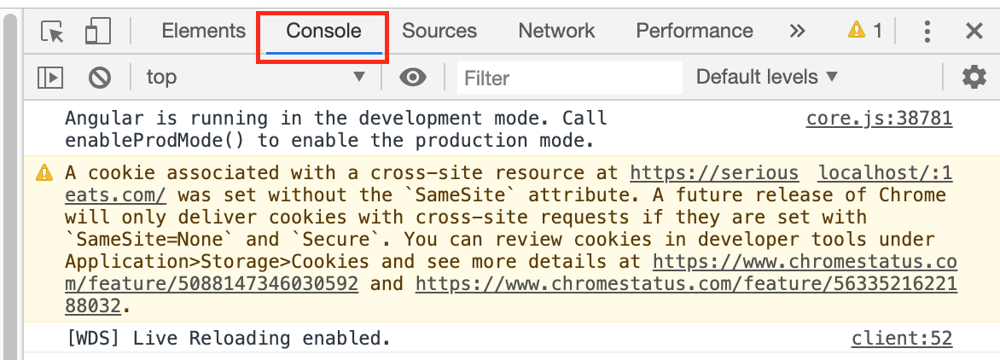
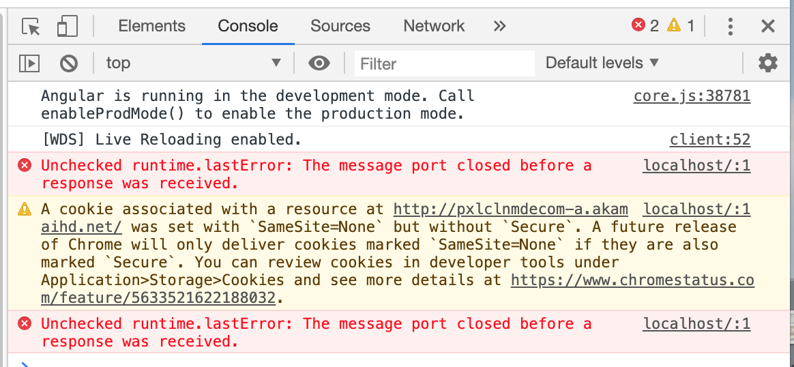
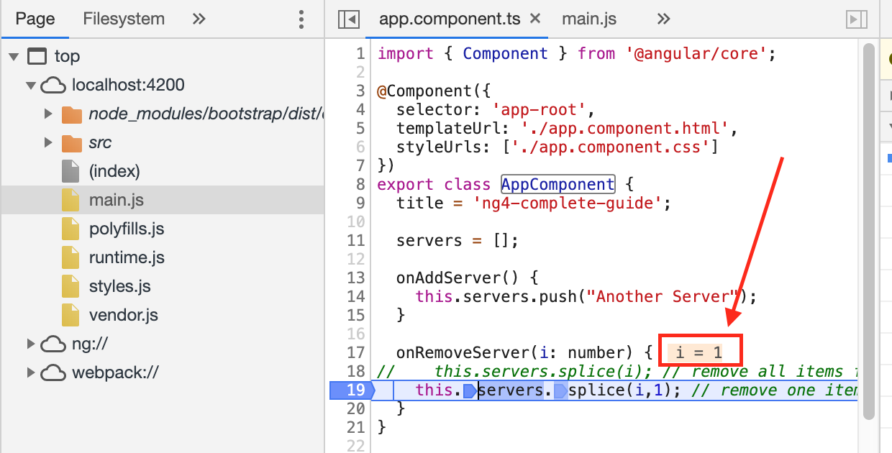
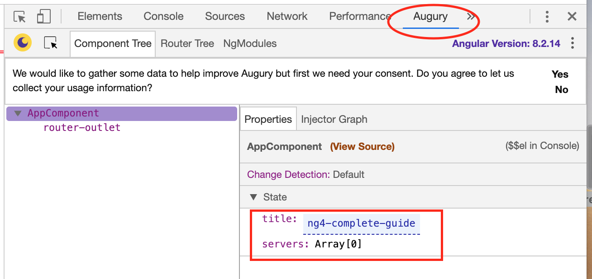
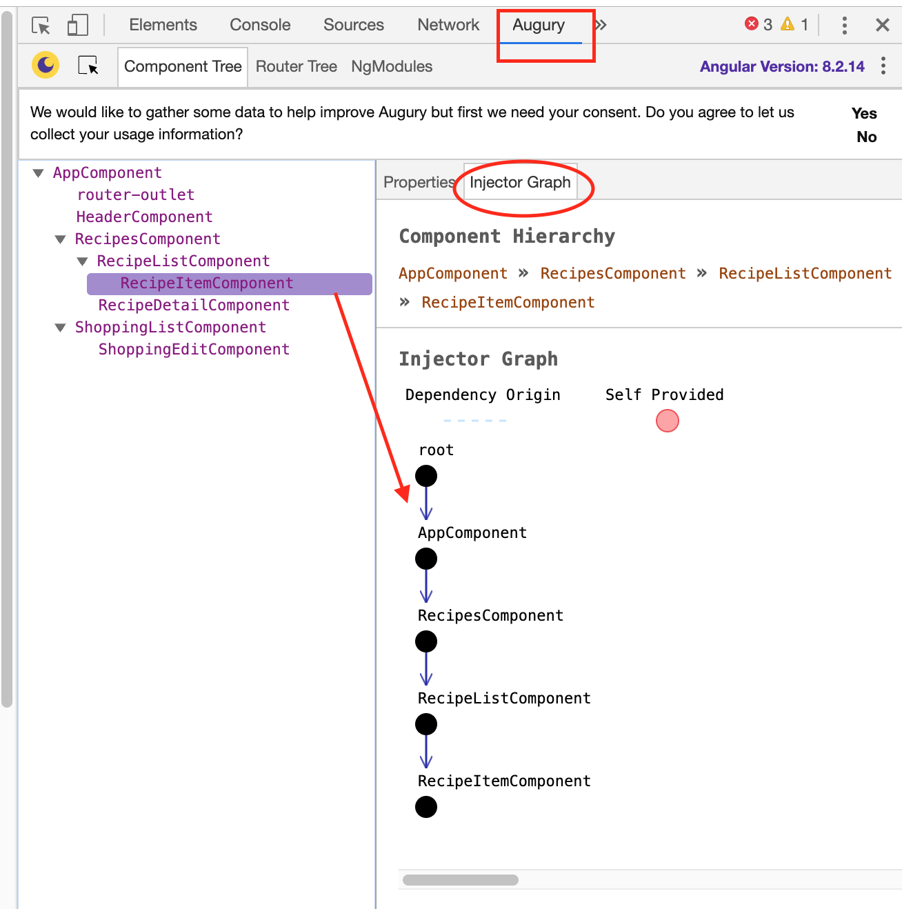

# NG4 Complete Guide

## Shopping Detail


## Push existing project to github.com
* Create a github repository on github;
* add the remote to local git repository
```bash
git remote add origin https://github.com/jwang1122/ng4-complete-guide.git
```
* Set upstream to master branch
```bash
git push --set-upstream origin master
```

## Find recipe images

* Google searh: Recipe images
* [Recipe - Image Results](https://images.search.yahoo.com/yhs/search;_ylt=AwrC3CL4kNpdpS8AggUPxQt.;_ylu=X3oDMTByMjB0aG5zBGNvbG8DYmYxBHBvcwMxBHZ0aWQDBHNlYwNzYw--?p=recipe&fr=yhs-domaindev-st_emea&hspart=domaindev&hsimp=yhs-st_emea#id=1&iurl=http%3A%2F%2Fmommacuisine.com%2Fassets%2Frecipe_image%2Fa%2Fq%2Fv%2Faqvqbanr%2Ffullsize.jpg&action=click)
* Right-click the image, Select "Copy Image Address"

## Errors
* Google Chrome Error



## Google Chrome Debugger
* [Start application on localhost:4200](http://localhost:4200/)
* Right-click on page, select inspect
* Select Sources in menu -> Page on submenu -> webpack:// in tree view

* Select Sources in menu, pickup src/main.js, [Ctrl+f) search for your component class name (AppComponent)
* Click on the class, the AppComponent.ts file will be opened
* Click on the left of the line number you want to break;


## Use Angular Augury
[Install Angular Augury as Chrome Extension](https://chrome.google.com/webstore/detail/augury/elgalmkoelokbchhkhacckoklkejnhcd/related)


